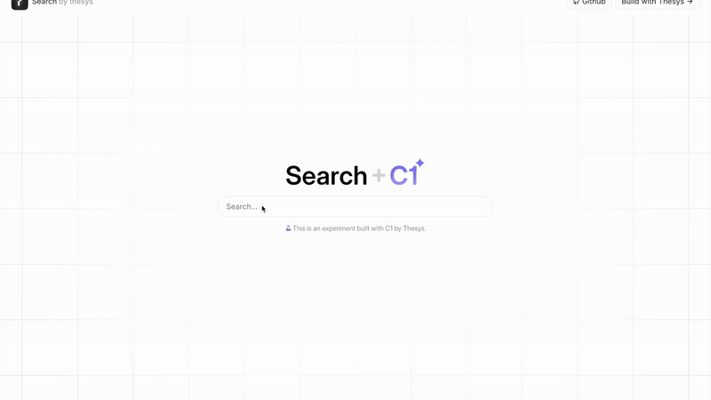

## Introduction

Experience the vast possibilities of web search reimagined through [Thesys](https://www.thesys.dev/), where large language models and generative UI combine to create dynamic, context-aware search experiences. From automatically generated data visualizations and interactive components to rich multimedia results and adaptive layouts, this demo showcases how generative UI transforms traditional search into an intelligent, visual, and highly engaging interface that understands and responds to your unique search intent.

## Demo



## Overview

This project reimagines what web search could be if combined with Thesys GenUI:

1. **Real-time web search** - Uses Google Search API to find the most relevant and up-to-date information regarding the searched query
2. **Advanced LLM processing** - After finding relevant links, extracts key content from each webpage and uses Gemini SDK to generate concise, contextual summaries of the information
3. **Generative UI components** - Dynamic components created on-the-fly based on search context using C1
4. **Interactive results** - A responsive interface that adapts to different types of queries

Unlike traditional search engines that show a list of links or AI platforms that generate plain text, this project creates rich, visual, and interactive search results tailored to each query.

## Tech Stack

- **Frontend**: Next.js 15 with App Router
- **UI**: Tailwind CSS, SASS, and Thesys GenUI SDK
- **AI Integration**: Thesys C1 SDK, Google Gemini
- **APIs**: Google Custom Search, Google Image Search
- **Streaming**: Real-time response streaming using Server-Sent Events

## Getting Started

### Prerequisites

- Node.js (v20+)
- PNPM
- API keys for required services

### Setup

1. Clone the repository:

   ```bash
   git clone https://github.com/thesysdev/search-with-c1.git
   cd search-with-c1
   ```

2. Install dependencies:

   ```bash
   pnpm i
   ```

3. Set up environment variables by copying `.env.example` to `.env`:

   ```bash
   cp .env.example .env
   ```

4. Add your API keys to the `.env` file:
   ```
   THESYS_API_KEY=your_thesys_api_key
   GOOGLE_API_KEY=your_google_api_key
   GOOGLE_CX=your_google_custom_search_id
   GEMINI_API_KEY=your_gemini_api_key
   ```

### Development

Run the development server:

```bash
pnpm run dev
```

Open [http://localhost:3000](http://localhost:3000) in your browser.

## How It Works

1. User enters a search query
2. The application sends the query to the Thesys C1 API
3. C1 utilizes tools to search the web and retrieve images in real-time
4. The search results are processed and enhanced with summaries
5. C1 generates a dynamic UI with the appropriate components based on the content
6. The response is streamed back to the client for a smooth user experience

## Contributing

Contributions are welcome! Please feel free to submit a Pull Request.

## License

This project is licensed under the MIT License - see the LICENSE file for details.

## Acknowledgments

- [Thesys](https://www.thesys.dev/) - Build GenUI Apps
- [C1 Documentation](https://docs.thesys.dev/welcome) - Learn how to use C1 and build AI apps
- [Example Apps](https://github.com/thesysdev/examples/tree/main) - Clone and explore more C1 example projects
- [Google](https://google.com) for their search and image APIs
- [Next.js](https://nextjs.org/) for the React framework
